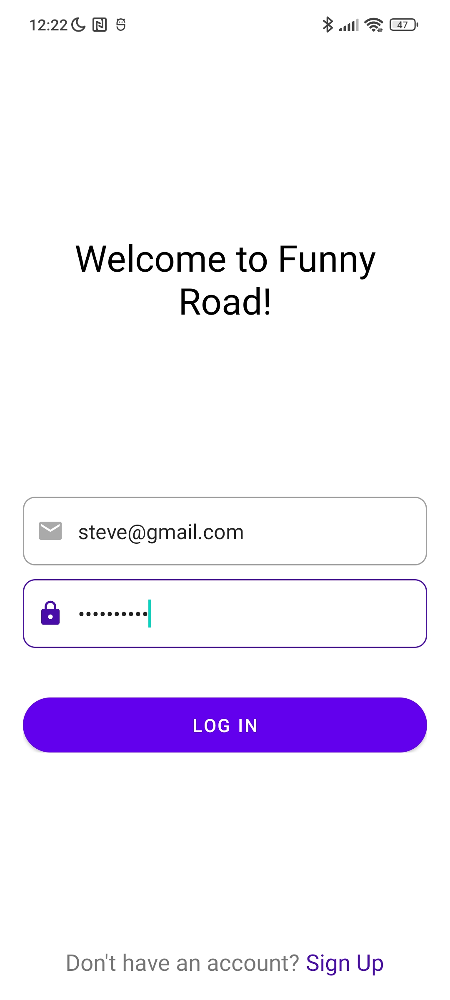
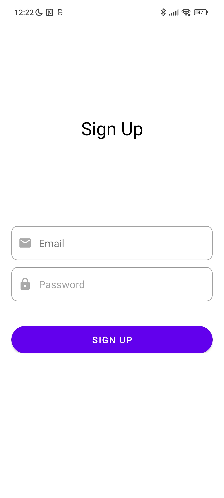
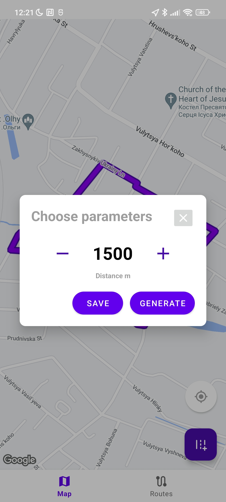
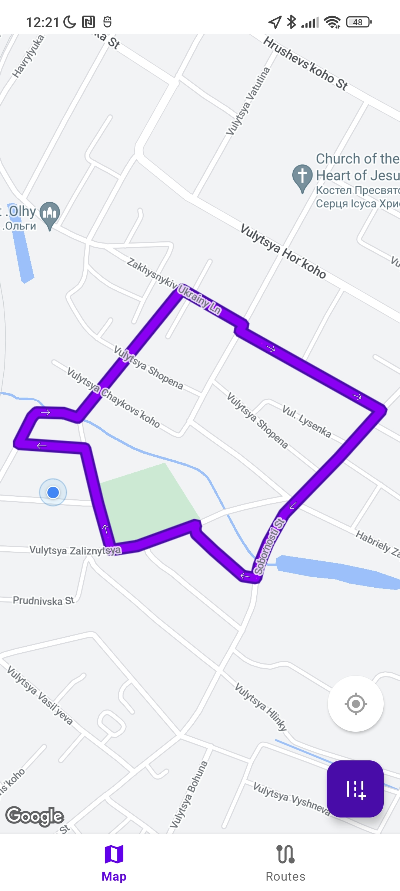
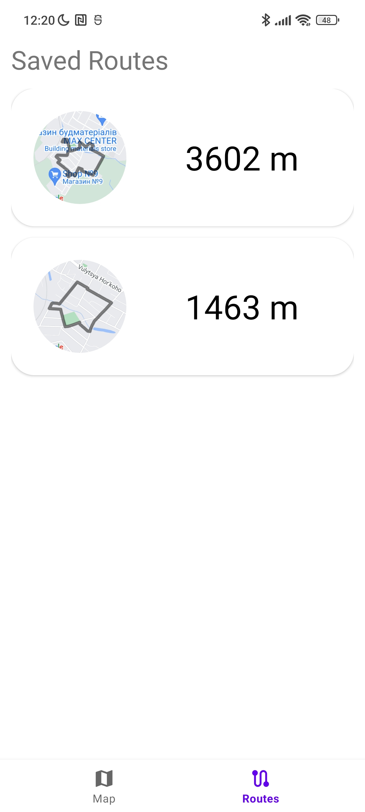

# Funny Road 

The app allows:

  * Authenticate with user's credentials
  * Generate routes with custom distance
  * Show the user's current location
  * Save routes
  * Delete routes
  * Use saved routes

Implemented:

  * MVVM
  * Retrofit
  * Firebase, Firebase Auth
  * Google map SDK
  * Fragments

